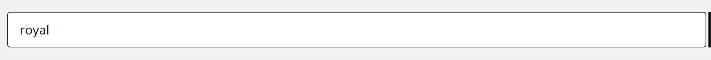

# Search

## A search page

URL: http://127.0.0.1:8000/search/catalogue/?filter_keyword=ufo&opening_start_date_0=&opening_start_date_1=&opening_start_date_2=&opening_end_date_0=&opening_end_date_1=&opening_end_date_2=&q=royal&per_page=20&sort_by=dateOpening&sort_order=asc&display=list&group=tna

- a website page
- a template
- this url renders the `catalogue_search.html` template

## Search term

- search term
- search box
- search query param
- maps to url param `q=royal`

## Search type

- search type
- search tab
- search results hero - nav links

## Search results explainer

## Search buckets

- search bucket
- bucket
- bucket with label and count
- api response aggregate buckets
- maps to url param `group=tna`

## Search results view options

- [list] [grid]
- maps to url param `dialpay=<value>`, ex:`dialpay=list`

## Search results title and count

- search results title with count

## Search filters

- search filters
- "refine results" inputs

### Search within results

- search within results
- a "refine results" input - search box
- search filter keyword
  - maps to url param `filter_keyword=<value>` ex: `filter_keyword=ufo`
  - search filter name is `filter_keyword`
- when input, it is a selected filter. This input value appears in the search selected filters area.

### Search filter checkboxes

- availability depends on the selected search bucket

#### Colletions filter

- collections filter
- search for collections
- a "refine results" input - checkbox
- maps to url param `collection=<value>`

#### Other checkbox filters

- various filters mapping to url params
  - Level: `level=<value>`
  - Closure Status: `closure=<value>`
  - Held by: `held_by=<value>`
  - Catalogue source: `catalogue_source=<value>`
  - Creator type: `type=<value>`
  - Country: `country=<value>`
  - Location: `location=<value>`

#### Record opening date filter

- Record opening date filter
- search for "Record opening dates"
- a "refine results" inputs for Record Opening dates - From, To
- From - maps to url params `opening_start_date_0=<value>`, `opening_start_date_1=<value>`, `opening_start_date_2=<value>`
- To - maps to url params `opening_end_date_0=<value>`, `opening_end_date_1=<value>`, `opening_end_date_2=<value>`

### Selected filter label

- selected filter label

### Search results area

- search results area - list view
- search results list card

- search results area - grid view
- search results list card - grid

### Record

- a record within the search results area
- Attributes
  - Delivery option Image, link
  - Summary title
  - Description
  - various attributes with labels
